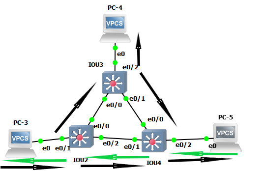

# TP2

## I. Simplest setup

* Topologie 


* Communication

Ping PC1 --> PC2


Le protocole utilisé par le `ping` est `ICMP`

L'échange `ARP` vue sur Wireshark correspond aux tables `ARP` des machines
```
PC-1> show arp

00:50:79:66:68:01  10.2.1.2 expires in 112 seconds
```

```
PC-2> show arp

00:50:79:66:68:00  10.2.1.1 expires in 110 seconds
```

Le switch sert à faire passer l'information il n'a pas besoin d'ip.


## II. More switch


PC1 = PC3   /   PC2 = PC4   /   PC3 = PC5

* Communication


```
PC-3> ping 10.2.2.2
84 bytes from 10.2.2.2 icmp_seq=1 ttl=64 time=4.706 ms
84 bytes from 10.2.2.2 icmp_seq=2 ttl=64 time=2.039 ms
84 bytes from 10.2.2.2 icmp_seq=3 ttl=64 time=4.482 ms
84 bytes from 10.2.2.2 icmp_seq=4 ttl=64 time=1.520 ms
84 bytes from 10.2.2.2 icmp_seq=5 ttl=64 time=3.536 ms
```

```
PC-4> ping 10.2.2.3
84 bytes from 10.2.2.3 icmp_seq=1 ttl=64 time=12.107 ms
84 bytes from 10.2.2.3 icmp_seq=2 ttl=64 time=1.999 ms
84 bytes from 10.2.2.3 icmp_seq=3 ttl=64 time=1.745 ms
84 bytes from 10.2.2.3 icmp_seq=4 ttl=64 time=1.568 ms
84 bytes from 10.2.2.3 icmp_seq=5 ttl=64 time=1.789 ms
```

```
PC-5> ping 10.2.2.1
84 bytes from 10.2.2.1 icmp_seq=1 ttl=64 time=1.522 ms
84 bytes from 10.2.2.1 icmp_seq=2 ttl=64 time=1.253 ms
84 bytes from 10.2.2.1 icmp_seq=3 ttl=64 time=1.700 ms
84 bytes from 10.2.2.1 icmp_seq=4 ttl=64 time=1.458 ms
84 bytes from 10.2.2.1 icmp_seq=5 ttl=64 time=1.303 ms
```

```
          Mac Address Table
-------------------------------------------

Vlan    Mac Address       Type        Ports
----    -----------       --------    -----
   1    0050.7966.6802    DYNAMIC     Et0/1
   1    0050.7966.6803    DYNAMIC     Et0/0
   1    0050.7966.6804    DYNAMIC     Et0/2
   1    aabb.cc00.0300    DYNAMIC     Et0/0
   1    aabb.cc00.0400    DYNAMIC     Et0/0
   1    aabb.cc00.0410    DYNAMIC     Et0/2
Total Mac Addresses for this criterion: 6
```
Vlan: Nous n'avons pas modifier le Vlan donc le Vlan par defaut est 1 pour la `Mac Address` désigné.

Mac Address: Adresse Mac des machines avec qui il communique

Type: Définie comment `Mac Address` est récupéré (ici en `DYNAMIC` car nous l'avons récupéré par une requete ARP) 

Ports: Quelle port communique à la `Mac Address` désigné


Cisco Discovery Protocol est un protocole de niveau 2 développé par Cisco permettant de ce connecté au péripherique voisin comme un routeur, un switch ou une machine.

* Spanning Tree Protocol

Le Switch `IOU2` est le `Root Bridge`
```
VLAN0001
  Spanning tree enabled protocol rstp
  Root ID    Priority    32769
             Address     aabb.cc00.0200
             This bridge is the root
             Hello Time   2 sec  Max Age 20 sec  Forward Delay 15 sec
   ...
   ``` 

Le Port `e0/0` de `IOU4` est désactivé
`Et0/0               Altn BLK 100       128.1    Shr` 
```
                        +-----+
                        | PC4 |
                        +--+--+
                           |
                           |
                  root +---+---+
                   +---+  SW3  +----+
                   |   +-------+    |
                   |                |
                   |                |altn
+-----+        +---+---+    root+---+---+        +-----+
| PC3 +--------+  SW2  +--------+  SW4  +--------+ PC5 |
+-----+        +-------+        +-------+        +-----+
                  RB
```

On ping `PC3` vers `PC5` et nous écoutons entre `SW2/SW4` et `SW3/SW4`
`SW2` envoie le broadcast à `SW3` et `SW4` puis `SW3` vers `SW4` mais `SW4` n'envoie rien vers `SW3` comme prévue.

`SW2 +-----+ SW4`


`SW3 +-----+ SW4`


1: Fleche noir: Broadcast

2: Fleche verte: Reply


On veut mettre `SW4` en `bridge root`:

`IOU4(config)#spanning-tree vlan 1 priority 4096`

`IOU4` est bien devenu le `Bridge root` :
```
VLAN0001
  Spanning tree enabled protocol rstp
  Root ID    Priority    4097
             Address     aabb.cc00.0400
             This bridge is the root
             Hello Time   2 sec  Max Age 20 sec  Forward Delay 15 sec
   ...
```

Avant:


Après:


## III. Isolation

### 1. Simple


* Vlan:
```
   VLAN Name                             Status    Ports
   ---- -------------------------------- --------- -------------------------------
   1    default                          active    Et0/3, Et1/0, Et1/1, Et1/2
                                                   Et1/3, Et2/0, Et2/1, Et2/2
                                                   Et2/3, Et3/0, Et3/1, Et3/2
                                                   Et3/3
   10   client-network                   active    Et0/0
   20   server-network                   active    Et0/1, Et0/2
```

* Ping:
`PC2` ping `PC3`
```
PC-2> ping 10.2.3.3
84 bytes from 10.2.3.3 icmp_seq=1 ttl=64 time=0.242 ms
84 bytes from 10.2.3.3 icmp_seq=2 ttl=64 time=0.335 ms
84 bytes from 10.2.3.3 icmp_seq=3 ttl=64 time=0.326 ms
84 bytes from 10.2.3.3 icmp_seq=4 ttl=64 time=0.301 ms
```

`PC1` ping `PC3`
```
   PC-1> ping 10.2.3.3
   host (10.2.3.3) not reachable
```

### 2. Trunk


* Interface trunk
```
IOU2#show  interfaces trunk

Port        Mode             Encapsulation  Status        Native vlan
Et0/1       on               802.1q         trunking      1

Port        Vlans allowed on trunk
Et0/1       10,20

Port        Vlans allowed and active in management domain
Et0/1       10,20

Port        Vlans in spanning tree forwarding state and not pruned
Et0/1       10,20
```

* Ping

`PC1` ne peut joindre que `PC3`
```
PC-1> ping 10.2.10.2
84 bytes from 10.2.10.2 icmp_seq=1 ttl=64 time=0.338 ms
84 bytes from 10.2.10.2 icmp_seq=2 ttl=64 time=0.482 ms
84 bytes from 10.2.10.2 icmp_seq=3 ttl=64 time=0.481 ms
84 bytes from 10.2.10.2 icmp_seq=4 ttl=64 time=0.410 ms
^C


PC-1> ping 10.2.20.2
No gateway found
```

`PC4` ne peut joindre que `PC2`
```
PC-4> ping 10.2.20.1
84 bytes from 10.2.20.1 icmp_seq=1 ttl=64 time=0.437 ms
84 bytes from 10.2.20.1 icmp_seq=2 ttl=64 time=0.447 ms
84 bytes from 10.2.20.1 icmp_seq=3 ttl=64 time=0.441 ms
^C


PC-4> ping 10.2.10.1
No gateway found
```

## IV Need perfs


```
IOU2#show ip interface po1
Port-channel1 is up, line protocol is up
  Inbound  access list is not set
  Outgoing access list is not set

```
