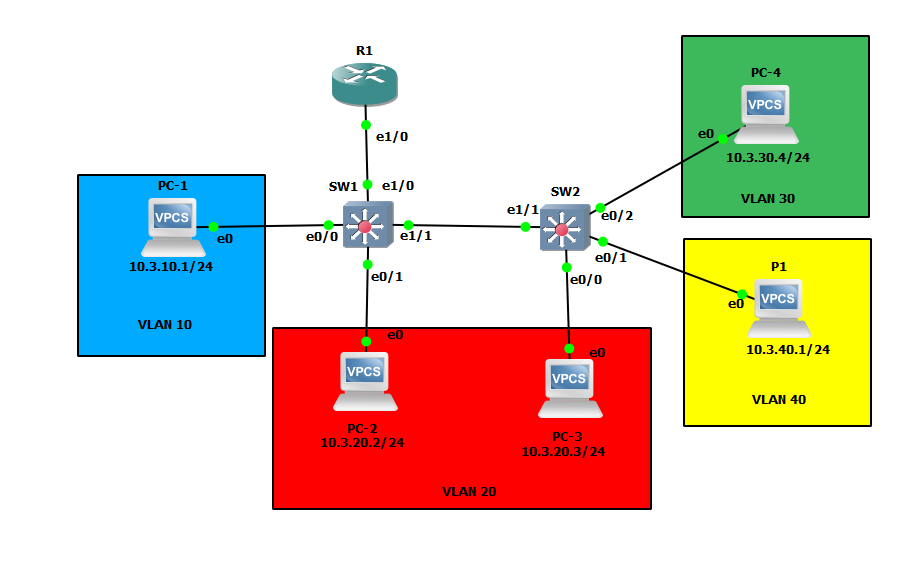
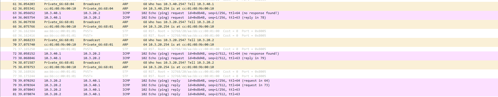

# TP3: Routage INTER-VLAN + mise en situation
## I. Router-on-a-stick



### Configuration des switch

Vlan :
```
VLAN Name                             Status    Ports
---- -------------------------------- --------- -------------------------------

10   client1-network                  active    Et0/0
20   client2-network                  active    Et0/1
30   client3-network                  active
40   imp-network                      active
```

Trunk :

```
Port        Mode             Encapsulation  Status        Native vlan
Et1/0       on               802.1q         trunking      1
Et1/1       on               802.1q         trunking      1

Port        Vlans allowed on trunk
Et1/0       20,30,40
Et1/1       20,30,40

Port        Vlans allowed and active in management domain
Et1/0       20,30,40
Et1/1       20,30,40

Port        Vlans in spanning tree forwarding state and not pruned
Et1/0       20,30,40
Et1/1       20,30,40
```

### Configuration routeur

```
Interface                  IP-Address      OK? Method Status                Protocol

Ethernet1/0                unassigned      YES unset  up                    up  
Ethernet1/0.10             10.3.10.254     YES manual up                    up  
Ethernet1/0.20             10.3.20.254     YES manual up                    up  
Ethernet1/0.30             10.3.30.254     YES manual up                    up  
Ethernet1/0.40             10.3.40.254     YES manual up                    up 
```

### PC-1 ping PC-2

```
PC-1> ping 10.3.20.2
host (10.3.10.254) not reachable
```

### PC-2 ping PC-4

```
PC-2> ping 10.3.30.4
10.3.30.4 icmp_seq=1 timeout
10.3.30.4 icmp_seq=2 timeout
84 bytes from 10.3.30.4 icmp_seq=3 ttl=63 time=14.203 ms
84 bytes from 10.3.30.4 icmp_seq=4 ttl=63 time=16.271 ms
84 bytes from 10.3.30.4 icmp_seq=5 ttl=63 time=12.936 ms
```

### PC-3 ping P1

```
PC-3> ping 10.3.40.1
10.3.40.1 icmp_seq=1 timeout
10.3.40.1 icmp_seq=2 timeout
84 bytes from 10.3.40.1 icmp_seq=3 ttl=63 time=16.923 ms
84 bytes from 10.3.40.1 icmp_seq=4 ttl=63 time=16.603 ms
84 bytes from 10.3.40.1 icmp_seq=5 ttl=63 time=19.994 ms
```

### Wireshark R1/SW1




## I. Cas concret

| R1   | 10.3.1.0   |
|------|------------|
| R2   | 10.3.2.0   |
| R3   | 10.3.3.0   |
| R4   | 10.3.4.0   |
| R5   | 10.3.5.0   |
| R254 | 10.3.254.0 |


| VLAN | 10     | 20    | 30         | 40      | 41 | 50         |
|------|--------|-------|------------|---------|----|------------|
|      | ADmins | Users | Stagiaires | Serveur | SS | Imprimante |