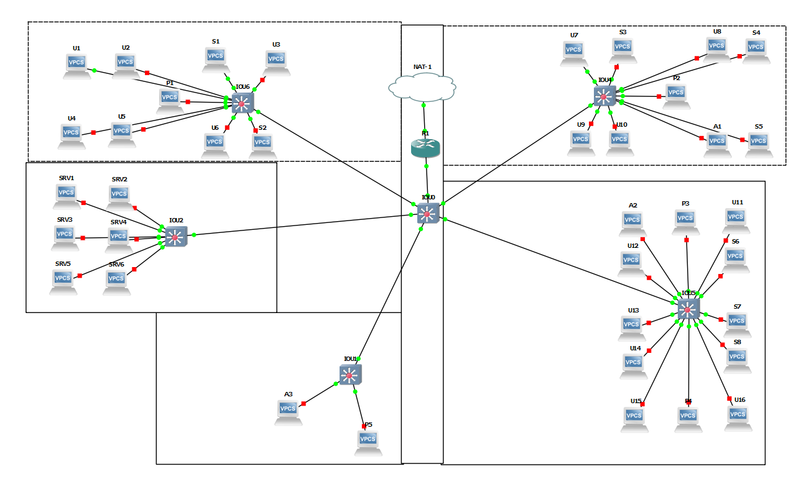

# TP3: Routage INTER-VLAN + mise en situation
## I. Router-on-a-stick


### Configuration des switch

Vlan :
```
VLAN Name                             Status    Ports
---- -------------------------------- --------- -------------------------------

10   client1-network                  active    Et0/0
20   client2-network                  active    Et0/1
30   client3-network                  active
40   imp-network                      active
```

Trunk :

```
Port        Mode             Encapsulation  Status        Native vlan
Et1/0       on               802.1q         trunking      1
Et1/1       on               802.1q         trunking      1

Port        Vlans allowed on trunk
Et1/0       20,30,40
Et1/1       20,30,40

Port        Vlans allowed and active in management domain
Et1/0       20,30,40
Et1/1       20,30,40

Port        Vlans in spanning tree forwarding state and not pruned
Et1/0       20,30,40
Et1/1       20,30,40
```

### Configuration routeur

```
Interface                  IP-Address      OK? Method Status                Protocol

Ethernet1/0                unassigned      YES unset  up                    up  
Ethernet1/0.10             10.3.10.254     YES manual up                    up  
Ethernet1/0.20             10.3.20.254     YES manual up                    up  
Ethernet1/0.30             10.3.30.254     YES manual up                    up  
Ethernet1/0.40             10.3.40.254     YES manual up                    up 
```

### PC-1 ping PC-2

```
PC-1> ping 10.3.20.2
host (10.3.10.254) not reachable
```

### PC-2 ping PC-4

```
PC-2> ping 10.3.30.4
10.3.30.4 icmp_seq=1 timeout
10.3.30.4 icmp_seq=2 timeout
84 bytes from 10.3.30.4 icmp_seq=3 ttl=63 time=14.203 ms
84 bytes from 10.3.30.4 icmp_seq=4 ttl=63 time=16.271 ms
84 bytes from 10.3.30.4 icmp_seq=5 ttl=63 time=12.936 ms
```

### PC-3 ping P1

```
PC-3> ping 10.3.40.1
10.3.40.1 icmp_seq=1 timeout
10.3.40.1 icmp_seq=2 timeout
84 bytes from 10.3.40.1 icmp_seq=3 ttl=63 time=16.923 ms
84 bytes from 10.3.40.1 icmp_seq=4 ttl=63 time=16.603 ms
84 bytes from 10.3.40.1 icmp_seq=5 ttl=63 time=19.994 ms
```

### Wireshark R1/SW1


## I. Cas concret

### Topologie



Les Switchs de chaque salle seront au milieu pour pouvoir connecté chaque machine avec des câbles court. Le tout sera relié part câbles long au Switch 0 qui reliera le Routeur part un câble court.
Attention: Les machines au extremite des salles auront peut être besoin de câbles Moyen. 

Court: 39 

Moyen: 0 

Long: 5 

### Configuration

#### Adressage

| Machine | Reseau      | Masque          | VLAN |
|---------|-------------|-----------------|------|
| A1-3    | 10.3.1.0/29 | 255.255.255.248 | 10   |
| U1-16   | 10.3.2.0/27 | 255.255.255.224 | 20   |
| S1-8    | 10.3.3.0/28 | 255.255.255.240 | 30   |
| P1-5    | 10.3.4.0/28 | 255.255.255.240 | 40   |
| SRV2-5  | 10.3.4.0/29 | 255.255.255.248 | 50   |
| SS1&6   | 10.3.5.0/29 | 255.255.255.248 | 60   |

|        X       | Admin |     User    |  Stag |  Imp  |  SRV  |    SS   |
|:--------------:|:-----:|:-----------:|:-----:|:-----:|:-----:|:-------:|
| Switch 1-4-5-6 | 0/1-3 | 1/0-3 2/0-3 | 3/0-3 | 4/0-3 |   X   |    X    |
|    Switch 2    |   X   |      X      |   X   |   X   | 1/0-3 | 0/1 0/2 |

Le switch `IOU0` nous sert de passerelle avant la connection au routeur donc tous ses ports sont en mode trunk.

| NAT     | Inside | Outside |
|---------|--------|---------|
| Routeur | 0/0    | 0/1     |


#### Mise en place des VLANs
Apres avoir configurer les switchs  ont ce retrouve avec cette configuration pour les Vlans.

```
VLAN Name                             Status    Ports
---- -------------------------------- --------- -------------------------------
1    default                          active
10   Admin                            active    Et0/1, Et0/2, Et0/3
20   User                             active    Et1/0, Et1/1, Et1/2, Et1/3
                                                Et2/0, Et2/1, Et2/2, Et2/3
30   Stag                             active    Et3/0, Et3/1, Et3/2, Et3/3
40   Imp                              active    Et4/0, Et4/1, Et4/2, Et4/3
50   SRV                              active
60   SS                               active
```

Le switch 2 est connecte seulement au serveur donc sa configuration est differente

```
VLAN Name                             Status    Ports
---- -------------------------------- --------- -------------------------------
1    default                          active    Et0/3, Et3/0, Et3/1, Et3/2
                                                Et3/3, Et4/0, Et4/1, Et4/2
                                                Et4/3
10   Admin                            active
20   User                             active
30   Stag                             active
40   Imp                              active
50   SRV                              active    Et1/0, Et1/1, Et1/2, Et1/3
                                                Et2/0, Et2/1, Et2/2, Et2/3
60   SS                               active    Et0/1, Et0/2
```

#### ACL
On mets en place des ACLs pour que les réseau et Vlans communique seulement entre eux. (Les exceptions ce feront plus tard)

```
Standard IP access list 10
    10 permit 10.3.1.0, wildcard bits 0.0.0.7
Standard IP access list 20
    10 permit 10.3.2.0, wildcard bits 0.0.0.31
Standard IP access list 30
    10 permit 10.3.3.0, wildcard bits 0.0.0.15
Standard IP access list 40
    10 permit 10.3.4.0, wildcard bits 0.0.0.15
Standard IP access list 50
    10 permit 10.3.5.0, wildcard bits 0.0.0.7
Standard IP access list 60
    10 permit 10.3.6.0, wildcard bits 0.0.0.7
```


#### NAT

On configure le routeur pour qu'il est acces à la nat
```
R1#ping 8.8.8.8

Type escape sequence to abort.
Sending 5, 100-byte ICMP Echos to 8.8.8.8, timeout is 2 seconds:
.!!!!
Success rate is 80 percent (4/5), round-trip min/avg/max = 60/83/96 ms
```

Je n'ais pas réussi à faire communiquer les PCs avec la nat avec la config ci-dessous:
```
interface Ethernet0/0
 no ip address
 ip nat inside
 ip virtual-reassembly
 half-duplex
!
interface Ethernet0/0.10
 encapsulation dot1Q 10
 ip address 10.3.1.5 255.255.255.248
 ip access-group 10 in
 ip access-group 10 out
 ip nat inside
 ip virtual-reassembly
!
...
```

### Vérification de l'infra

Avec l'infra actuelle les PCs ce ping entre eux seulement s'ils sont du meme type (Admin, Users, Stagiraire, Imprimante, Serveur, Serveur sensible)

User1 -> Stagiaire3
```
U1> ping 10.3.3.3
*10.3.2.29 icmp_seq=1 ttl=255 time=9.425 ms (ICMP type:3, code:13, Communication administratively prohibited)
*10.3.2.29 icmp_seq=2 ttl=255 time=3.853 ms (ICMP type:3, code:13, Communication administratively prohibited)
*10.3.2.29 icmp_seq=3 ttl=255 time=8.999 ms (ICMP type:3, code:13, Communication administratively prohibited)
*10.3.2.29 icmp_seq=4 ttl=255 time=2.822 ms (ICMP type:3, code:13, Communication administratively prohibited)
*10.3.2.29 icmp_seq=5 ttl=255 time=2.622 ms (ICMP type:3, code:13, Communication administratively prohibited)
```

User1 -> User7
```
U1> ping 10.3.2.7
84 bytes from 10.3.2.7 icmp_seq=1 ttl=64 time=0.697 ms
84 bytes from 10.3.2.7 icmp_seq=2 ttl=64 time=1.444 ms
84 bytes from 10.3.2.7 icmp_seq=3 ttl=64 time=0.672 ms
84 bytes from 10.3.2.7 icmp_seq=4 ttl=64 time=0.983 ms
84 bytes from 10.3.2.7 icmp_seq=5 ttl=64 time=0.984 ms
```

Stagiaire3 - Imp4

```
S3> ping 10.3.4.4
*10.3.3.13 icmp_seq=1 ttl=255 time=19.764 ms (ICMP type:3, code:13, Communication administratively prohibited)
10.3.4.4 icmp_seq=2 timeout
*10.3.3.13 icmp_seq=3 ttl=255 time=2.426 ms (ICMP type:3, code:13, Communication administratively prohibited)
10.3.4.4 icmp_seq=4 timeout
*10.3.3.13 icmp_seq=5 ttl=255 time=7.970 ms (ICMP type:3, code:13, Communication administratively prohibited)
```

Admin -> Imp4
```
A3> ping 10.3.4.4
*10.3.1.5 icmp_seq=1 ttl=255 time=9.980 ms (ICMP type:3, code:13, Communication administratively prohibited)
*10.3.1.5 icmp_seq=2 ttl=255 time=8.450 ms (ICMP type:3, code:13, Communication administratively prohibited)
*10.3.1.5 icmp_seq=3 ttl=255 time=2.258 ms (ICMP type:3, code:13, Communication administratively prohibited)
*10.3.1.5 icmp_seq=4 ttl=255 time=1.514 ms (ICMP type:3, code:13, Communication administratively prohibited)
*10.3.1.5 icmp_seq=5 ttl=255 time=8.070 ms (ICMP type:3, code:13, Communication administratively prohibited)
```
